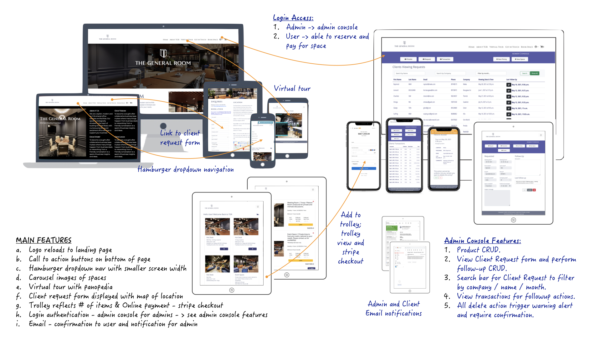
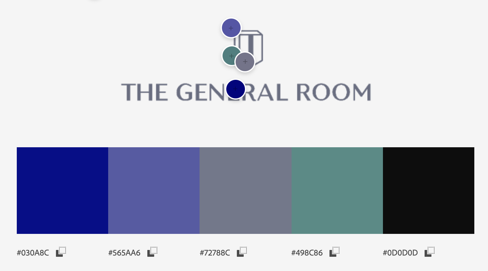
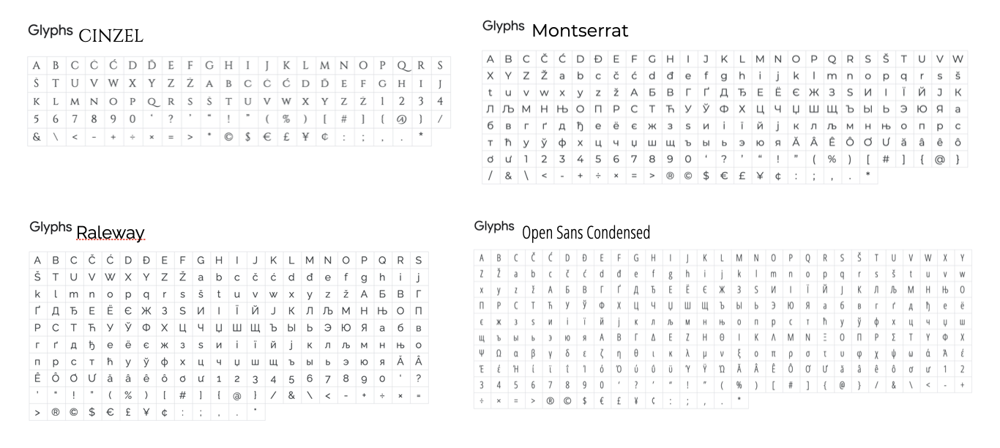
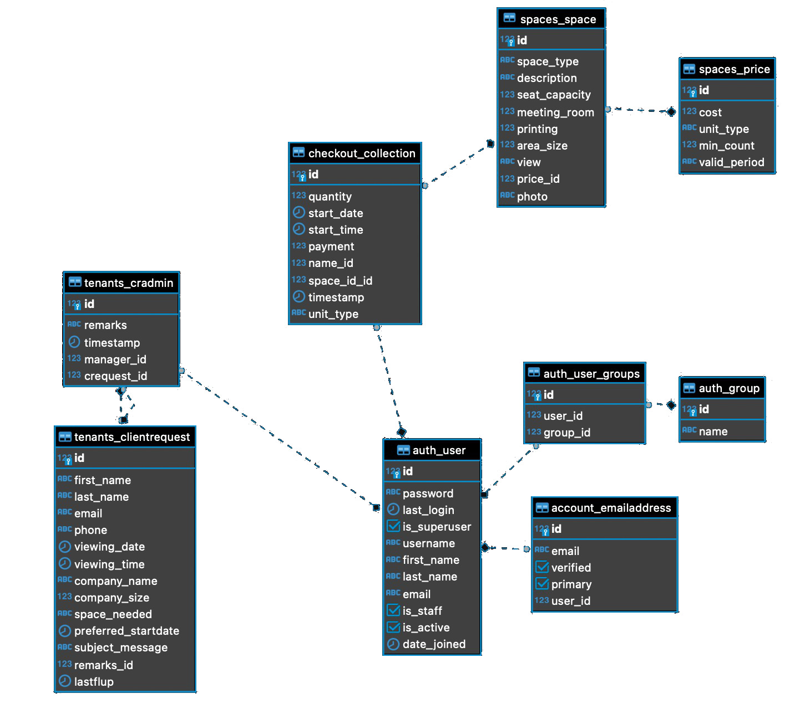

## Code Institute Milestone Project 4 - Fullstack Frameworks with Django

### General Room | Co-Working Space

The goal of this project is to demonstrate the potential of what a fullstack development can offer for The General Room; 
with current focus and features limited to CRM database and some e-commerce functions.

The targetted main users of this site are:
1. (owner) TGR management for the following:
    - track that all client requests are attended to by staffs.
    - automate current manual processes.
2. TGR staffs / client service administrators for the following actions:
    - view, add, update, or remove products following the fluid nature of the business and promotional items. 
    - manage and followup on client requests efficiently and effectively with less paperwork.
    - follow up on transacted trails.
3. Clients and general public / new clients:
    - learn more about TGR and its offering.
    - on-line payment for products esp. for repeat customers.

#### The General Room (TGR) - Background
  
We are a boutique coworking space with a mission of providing stylish, modern and no-frills environment to help businesses get things done. 
We are conveniently located in Orchard and Somerset with sophisticated and well equipped business meeting rooms for your needs.

TGR is also available for short term rentals.

### UX - User Experience

Wireframe of the build design includes:

 

 Black: symbolizes elegance and sophistication.  
 Teal: represents a calm, open, transparent relationship and dignified business dealings.  
 
 Shades of Gray: representing a stern and uncompromising nature; a General. 
 
 
 Shades of Blue: associated with blue blooded nobility and aristrocractic birth. 

 

Colors & Font families for UI/UX is inherited and consistent with TGR's brand image, values and identity: 
personifying a blue blooded, accomplished and stately military General, highly decorated with badges of honour.

Payment UX/UI demo with email confirmation for user. Recorded with iphone11.  

 

* HEROKU no longer supports free tier postgres, demo site is unavailable indefinitely *

A demo of the site can be found here [tgrlgbdemo.herokuapp.com]
- Login as general user: 
    - username: user 
    - password: user1234  
     
- Login as admin / staff: 
    - username: admin 
    - password: admin1234

 

## Built With 
### Technologies
1. HTML 5.0 + CSS
2. Bootstrap 5.0 - CSS & JS [https://getbootstrap.com/](https://getbootstrap.com/)
3. Python + Django
4. JQuery 
5. Toastr [https://codeseven.github.io/toastr/](https://codeseven.github.io/toastr/)
6. Uploadcare [https://uploadcare.com/](https://uploadcare.com/)
7. Heroku [https://www.heroku.com/](https://www.heroku.com/) as deployment host.

### Styling
1. Google Fonts [https://fonts.google.com/](https://fonts.google.com/) for font-family pairings.
2. Fontawesome [https://fontawesome.com/](https://fontawesome.com/) for icons.
3. Gimp 2.10 [https://www.gimp.org/](https://www.gimp.org/) for image manipulation.
4. Adobe Color [https://color.adobe.com/](https://color.adobe.com/) to extract TGR base color chart.

### Testing
[W3C Validator](https://validator.w3.org/) for html validation. All errors dealt with save for Jinja templating errors/ warnings. Specifically uploadcare input.

[Jigsaw CSS Validator](https://jigsaw.w3.org/css-validator/) for css validation. no errors found.

| Action (development testing)             | Results                       | Status      |
| -----------------------------------------|:-----------------------------:|-------------|
| Submission of empty forms                | Unable to submit as expected  | COMPLETED   |
| Submission of invalid data in forms      | Alert and error trigger fixed | COMPLETED   |
| Loading in Chrome                        | Margin issues noted, fixed    | COMPLETED   |                         
| Loading in Firefox                       | Time widget not supported     |    nil      |
| Trolley add & stripe checkout            | Webhook issues fixed          | COMPLETED   |         
| Rezising of viewport widths              | Flexbox issues fixed          | COMPLETED   |
| Checkout / Client request autogen emails | message string issue fixed    | COMPLETED   |

| <h3>**User Features Tests during development**                                                                                                                                                                                                                                                                                                                                                                                                                                                                                               |
| :------------------------------------------------------------------------------------------------------------------------------------------------------------------------------------------------------------------------------------------------------------------------------------------------------------------------------------------------------------------------------------------------------------------------------------------------------------------------------------------------------------------------------------------- |
| **Test 1: Hyperlinks of navigation tabs / hamburger dropdowns with multiple screen size.**                                                                                                                                                                                                          |
| **Expected:** 1. Navbar brings me to different specified pages. 2. Navbar turns to hamburger dropdown when screensize drops.   **Test:** Clicking on all different links to reload multiple times.  **Result:** Multiple issues with some images noted; margins and flex issues noted; navigation controls works as expected.                                                                                                                                                            |
| **Test 2: Admin console navigation and functions**                                                                                                                                                                                                          |
| **Expected:** 1. on button click brings me to desired pages for CRUD actions where available  **Test:** Clicking on all different buttons to reload table or forms multiple times.  **Result:** page loads and reloads as expected                                                                                                                                                            |
| **Test 3: Admin CRUD**
| **Expected:** create reflected immediately in read; update forms display values to be edited; delete warning prior to action. form validation and error triggers for invalid data   **Test:** added new pricing to price list, added new space product to space listing; attempted invalid data submission, edited the info in each entry; deleted the entry **Result:** multiple issues with display size and margins esp. for smaller viewport width 
| **Test 4: Authentication**                                                                                                                                                                                                          |
| **Expected:** all links and follow-on on screen instructions loads and responds to user.   **Test:** Clicking on all different links to sign-up, sign-in, forget password, change password multiple times following on screen instructions   **Results:** all responds as expected except for sign-in link on password changed page that does not respond. Fixed path.                                                                                                                                                             |
| **Test 5: Trolley and Checkout**                                                                                                                                                                                                          |
| **Expected:** items to be able to add, price automatically adjusted; successful stripe payment triggers 1. transacted data storage 2. email notification to admin and client confirmation email.   **Test:** add item to trolley, proceed with stripe payment testing   **Results:** multiple failed attempts. found error in port set to private. Fixed.                                                                                                                                            |
| **Test 6: Emails**                                                                                                                                                                                                          |
| **Expected:** receive email with confirmation of payment made   **Test:** add items to trolley, stripe checkout   **Results:** email received as expected when stripe is successful and port setting is correct.                                                                                                                                            |

**User Features Testing (HEROKU Deployment)**  
[Heroku Deployment User Tests detailed documentation](static/assets/readme/tgrlgb_UserTesting.pdf)

## Features
### Existing Features
1. Logo reloads to landing page
2. Collapsible Navbar links into hamburger dropdown on smaller screen width
3. Call to action buttons on bottom of page
4. Carousel images of spaces (products)
5. Icons as TGR's service pledge
6. Comparative table breakdown for service and price
7. Virtual tour with panopedia
8. Client request form displayed with map of location and public transport info
9. Login authentication to access members only area
    - Admin console 
        - Product CRUD
        - View Client Request form and perform follow-up CRUD
        - Search bar for Client Request listing to filter by company / name / month
        - View transactions for followup actions - ordered by most recent
        - All delete action trigger warning alert for confirmation of data removal from database.
10. Trolley reflects # of items throughout site 
11. Online payment - stripe checkout
12. Autogenerated emails
    - Confirmation for user
    - Notification for admin
13. Responsive design for a variety of viewport sizes

### Features left to Implement
1. Search bar for transactions
2. Pagination for client request listings and transactions
3. Improvement in visual design of autogenerated emails to include receipts and transaction or order id # for reference
4. Report generation for monthly transacted volume etc.
5. Integration with google calendar for meeting room availability - auto block
6. Addition and tabulation of gst charges

## Deployment
Steps taken to deploy on HEROKU:  
1. Preparations:
    - install dependencies
        - gunicorn
        - psycopg2
        - Pillow
        - whitenoise
        - dj_database_url
    - update requirements.txt to include the above dependencies
2. Add whitenoise line code to middleware
3. Check that all files are in order specifically .env file is being included in .gitignore
4. Authenticated login into heroku in bash and also in browser
5. Create app tgrlgbdemo in heroku
4. Check git remote to confirm repo connection
5. Refresh heroku on browser, locate app and transferred all .env items into config vars
6. Create Procfile 
7. Update requirements.txt
8. Git add, commit and push to both github and heroku for app build
9. Test deployment on various devices and browsers following user testing checklist
10. Fix all errors and redeploy
12. Generate new secret key, update config vars, limit allowed hosts, turn off debug
13. Recheck, final deploy
14. RETEST!!!

## Acknowledgements

### References
1. [https://docs.djangoproject.com/en/3.0/ref/models/fields/](https://docs.djangoproject.com/en/3.0/ref/models/fields/)
2. [https://www.geeksforgeeks.org/datetimefield-django-forms/](https://www.geeksforgeeks.org/datetimefield-django-forms/)
3. [https://docs.djangoproject.com/en/3.1/ref/forms/widgets/](https://docs.djangoproject.com/en/3.1/ref/forms/widgets/)
4. [https://codepen.io/riyos94/pen/NXgXdp](https://codepen.io/riyos94/pen/NXgXdp)
5. [https://larsmidgaard.no/css-trick-fluid-text-size-with-max-font-size/](https://larsmidgaard.no/css-trick-fluid-text-size-with-max-font-size/)
6. [http://www.learningaboutelectronics.com/Articles/How-to-use-template-filters-in-Django.php](http://www.learningaboutelectronics.com/Articles/How-to-use-template-filters-in-Django.php)
7. [https://dev.to/megazear7/google-calendar-api-integration-made-easy-2a68](https://dev.to/megazear7/google-calendar-api-integration-made-easy-2a68)

### Credits
- .gitignore from [https://www.toptal.com/developers/gitignore/api/django](https://www.toptal.com/developers/gitignore/api/django)
- Allauth templates adapted from [https://github.com/pennersr/django-allauth/tree/master/allauth/templates](https://github.com/pennersr/django-allauth/tree/master/allauth/templates)
- Toastr options form [https://codeseven.github.io/toastr/demo.html](https://codeseven.github.io/toastr/demo.html)
- Google maps [https://google-map-generator.com/](https://google-map-generator.com/)
- Django SecretKey Generator [https://djecrety.ir/](https://djecrety.ir/)
- Mov to Gif Converter [https://cloudconvert.com/mov-to-gif](https://cloudconvert.com/mov-to-gif)
- Global Trent College mentors: Paul(KunXin) and Ace
- Global Trent College coursemates for lively discourse 

### Special Thanks
1. Sean Lim, Owner, LGB Group
2. KK Kam, CEO, Wellco Capital
3. Pamela, Administrator, TGR
